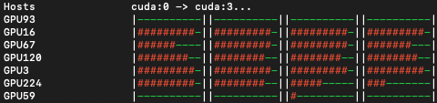

# GPU monitor

A simple tool for retrieving GPU related information for hosts defined in your ssh config file.

Does not require other python packages.

## Usage
```
python3 gpu_monitor.py -h

usage: gpu_monitor.py [-h] [--ssh_config SSH_CONFIG] [--max_workers MAX_WORKERS]

options:
  -h, --help            show this help message and exit
  --ssh_config SSH_CONFIG
                        Path to ssh config file
  --max_workers MAX_WORKERS
                        Maximum number of workers to use
```

## Expected Output


