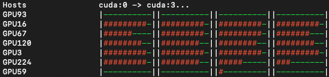

# GPU monitor



A simple tool for retrieving GPU related information for hosts defined in your ssh config file.

Does not require other python packages.

## Usage
```
python3 gpu_monitor.py -h

usage: gpu_monitor.py [-h] [--ssh_config SSH_CONFIG] [--max_workers MAX_WORKERS]

options:
  -h, --help            show this help message and exit
  --ssh_config SSH_CONFIG
                        Path to ssh config file
  --max_workers MAX_WORKERS
                        Maximum number of workers to use
```

Alternatively, you may wish to convert it into an executable.

For macOS:
1. Change default value for argument ssh_config to match the location of your ssh config file.
2. Add ```#!/usr/bin/env python3``` to top of gpu_monitor.py.
3. Rename gpu_monitor.py to gpu_monitor.command.
4. ```chmod +x gpu_monitor.command```
5. Double click, your system should prompt you that it is attempting to run. Set the appropriate permissions and run.

For Windows:
1. Use pyinstaller to generate an executable, then run.

